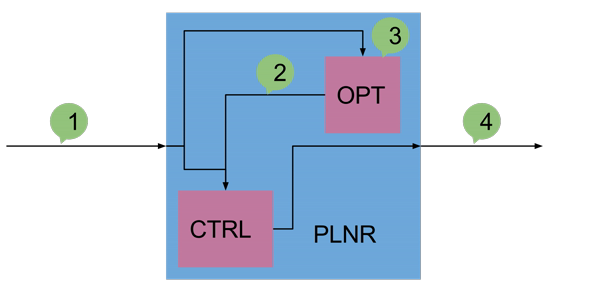

# DRHMP plugin for ROS navigation stack


# Dependencies

## ROS (assuming ros-indigo-desktop-full already installed):

```sh
sudo apt-get install ros-indigo-navigation -y
sudo apt-get install ros-indigo-nlopt -y
sudo apt-get install ros-indigo-gmapping -y
sudo apt-get install ros-indigo-turtlebot -y
```

## G++ 4.9:

```sh
sudo add-apt-repository ppa:ubuntu-toolchain-r/test
sudo apt-get update
sudo apt-get install g++-4.9
```

## For using matplotlib whithin cpp code when testing:

```sh
sudo apt-get install python-gtk2 python-gtk2-dev -y
sudo apt-get install gtkmm-2.4 -y
```

## CMake 3:

```sh
sudo apt-get install software-properties-common -y
sudo add-apt-repository ppa:george-edison55/cmake-3.x
sudo apt-get update
```

When cmake is not yet installed:

```sh
sudo apt-get install cmake
```

When cmake is already installed:

```sh
sudo apt-get upgrade
```

## Fix nlopt lib (no need for kinetic):

```sh
sudo ln -s /opt/ros/indigo/lib/libnlopt_cxx.so /opt/ros/indigo/lib/libnlopt_cxx.so.0
```

## Logs:



## Send goal to robot

```sh
rostopic pub tb00/move_base/goal move_base_msgs/MoveBaseActionGoal '{ header: { seq: 0, stamp: 0, frame_id: "map"}, goal_id: { stamp: 0, id: "map" }, goal: {target_pose: {header: {seq: 0, stamp: 0, frame_id: "map"}, pose:{position:{x: 0., y: 0., z: 0\. }, orientation:{x: 0., y: 0., z: 0., w: 1.}}}}}'
```

## Multi-robot setup

Environment variables:

```sh
export ROS_NAMESPACE=tb00
export TURTLEBOT_NAME=tb00
```

Launch file:

```xml
<param name="tf_prefix" value="tb00_tf" />
```

Took the following out from `demo.launch`

```xml
<arg name="scan_topic" value="/scan"/>
```

```sh
rosrun kobuki_ftdi create_udev_rules
```

```sh
chrt --rr 99 roslaunch turtlebot_2dnav 2d_nav_demo.launch
```
